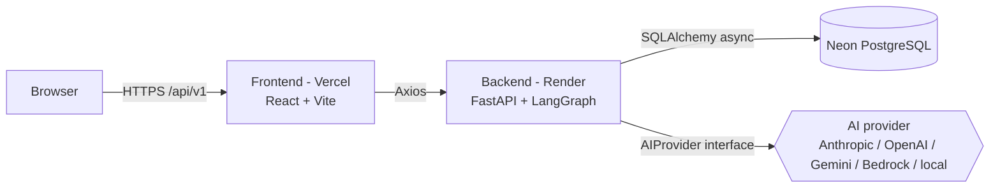
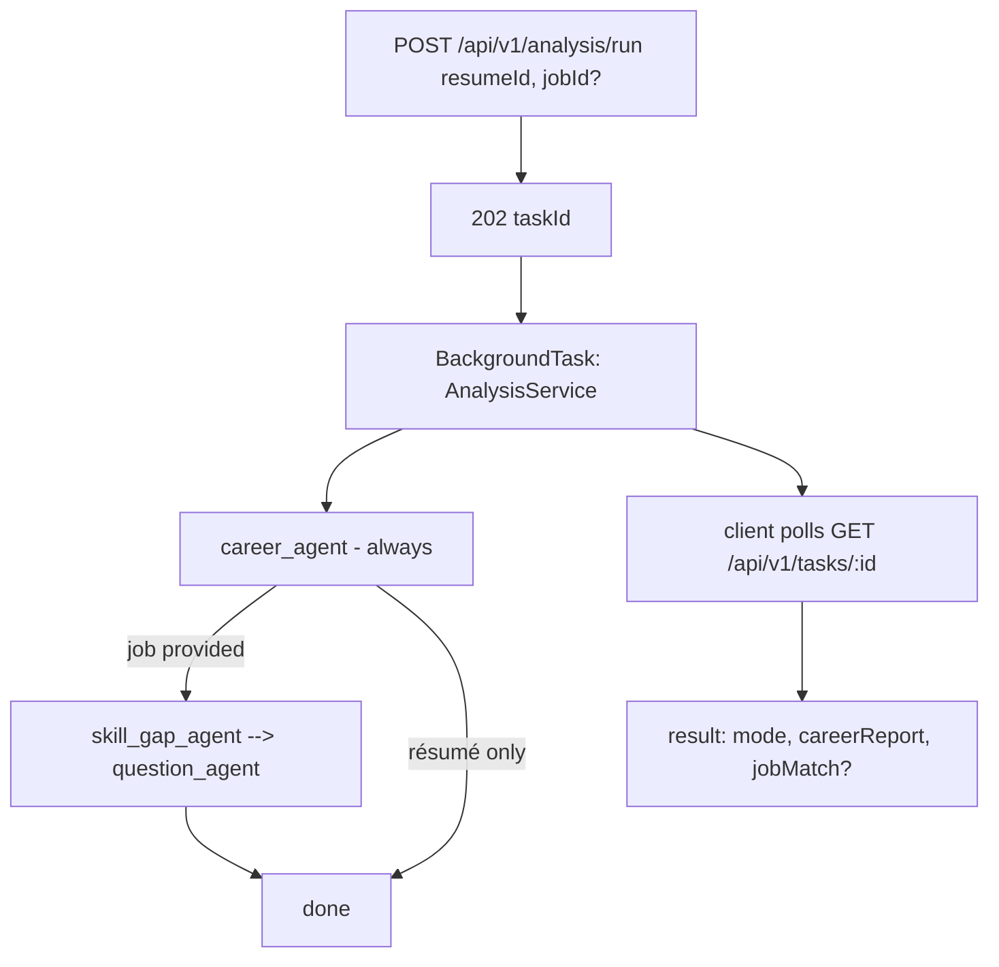

# InterviewIQ

> AI résumé intelligence and interview readiness. Upload a résumé and get an
> evidence-based recruiter-grade audit; add a job description to also get a
> job-match analysis with skill gaps and predicted interview questions.


**Live demo**

| | URL |
|---|---|
| Frontend (Vercel) | https://interview-iq-areeb-syed.vercel.app |
| Backend API (Render) | https://interviewiq-02c1.onrender.com |
| API docs (Swagger) | https://interviewiq-02c1.onrender.com/docs |

> The backend runs on a free Render instance and may **cold-start** (a few seconds) on the first request after idle.

---

## Overview

InterviewIQ reads a résumé the way a skeptical recruiter and an ATS would, and produces an
**evidence-driven report**. A job description is **optional**:

- **Résumé only** → a Career Intelligence Report (recruiter + ATS + hiring-manager audit).
- **Résumé + job** → the same report **plus** a job-match analysis (skill gaps, readiness score, predicted questions).

Everything is one extended LangGraph pipeline (not separate workflows), every score traces to
résumé text and carries a confidence level, and the AI provider is fully swappable via environment
variables (Anthropic / OpenAI / Gemini / AWS Bedrock / any OpenAI-compatible or local model).

---

## Features

- **Résumé upload** — PDF parsing (`pdfplumber`) into structured data.
- **Career Intelligence Report (evidence-based)**:
  - Candidate-stage detection (fair, stage-appropriate standards for students / early-career).
  - **Recruiter simulation** — 10-second / 30-second / full review + a verdict (Strong Shortlist → Reject).
  - **Career projection** — employability, internship, entry-level, interview, startup & enterprise probabilities.
  - **True ATS analysis** — field-by-field parse (pass / fail / at-risk), blockers, warnings, strengths, and how an ATS likely reads the résumé.
  - **Section-by-section review**, **project assessment** (judged by category; engineering vs business impact — portfolio/learning work is not penalized for missing users/revenue).
  - **Market positioning** — realistic / stretch / unlikely roles with reasons.
  - **Gap analysis** (why employers care, how it’s evaluated, how to acquire), **credibility flags**, and prioritized **before→after** improvements.
  - Every conclusion carries reasoning, evidence found/missing, and a **confidence** level; uses `insufficient_data` instead of guessing; strict anti-inflation scoring; never fabricates metrics.
- **Job match (optional)** — paste a job URL or text → skill gaps, readiness score, predicted questions.
- **Provider-agnostic AI** — switch providers by editing `.env` (see [docs/AI_PROVIDERS.md](docs/AI_PROVIDERS.md)).
- **Async submit→poll** pipeline; **report export** (copy / Save-as-PDF / share); **dark mode**; mobile-friendly.

---

## Architecture



Backend layering: **Router → Controller → Service → Repository → DB**, with dependency injection,
a provider-agnostic AI layer, an in-memory cache + task store (Redis optional), and a central
exception handler that returns a uniform envelope.



Full detail: [docs/ARCHITECTURE.md](docs/ARCHITECTURE.md) · actual file tree: [docs/PROJECT_STRUCTURE.md](docs/PROJECT_STRUCTURE.md).

---

## Screenshots

> _Placeholder — add images/GIFs here._

| Landing | Upload | Report |
|---|---|---|
| _TODO_ | _TODO_ | _TODO_ |

---

## Tech stack

| Layer | Technology |
|-------|------------|
| Frontend | React 18, TypeScript, Vite, Tailwind CSS (dark mode), TanStack Query, React Router, Axios |
| Backend | Python 3.11, FastAPI, Pydantic v2, SQLAlchemy 2.0 (async), Alembic, structlog, slowapi |
| AI | LangGraph orchestration + provider-agnostic layer (Anthropic / OpenAI / Gemini / AWS Bedrock / OpenAI-compatible & local) |
| Database | PostgreSQL (Neon in production, Postgres container locally) |
| Parsing/scraping | `pdfplumber` (résumé), `httpx` + `BeautifulSoup4` (job URL) |
| Hosting | Vercel (frontend), Render (backend), Neon (database) |
| Tooling | ruff, black, mypy, pytest (backend); ESLint, tsc (frontend); Docker Compose; GitHub Actions |

**Package managers:** backend = **pip** (PEP 621 `pyproject.toml`, editable install; `uv` optional) · frontend = **npm**.

---

## Folder structure

```
InterviewIQ/
├── server/   # FastAPI + LangGraph backend (entry: app/main.py)
├── client/   # React + Vite frontend (entry: src/main.tsx)
├── docker/   # server.Dockerfile + docker-compose.yml (postgres + server)
├── scripts/  # setup.sh (one-command local bootstrap)
├── docs/     # architecture, API, database, AI providers, structure, etc.
└── .github/  # CI workflow (lint + type-check + test)
```

Annotated, file-level tree: **[docs/PROJECT_STRUCTURE.md](docs/PROJECT_STRUCTURE.md)**.

---

## Local setup

**Prerequisites:** Python 3.11, Node.js 20+, Docker (for Postgres), an AI provider key
(Anthropic by default; or use a local model — see [docs/AI_PROVIDERS.md](docs/AI_PROVIDERS.md)).

```bash
git clone https://github.com/4reeb-5yed/InterviewIQ.git
cd InterviewIQ
./scripts/setup.sh        # copies .env files + installs backend & frontend deps
```

`setup.sh` does not start anything — it prepares the workspace and prints next steps.

### Environment variables

**Backend** (`server/.env`, template `server/.env.example`):

| Variable | Required | Default | Purpose |
|----------|----------|---------|---------|
| `PORT` | no | `8000` | Server port (Render injects `$PORT`) |
| `ENVIRONMENT` | no | `development` | `development` enables console logs |
| `ALLOWED_ORIGINS` | yes (prod) | `http://localhost:5173` | Comma-separated CORS origins |
| `AI_PROVIDER` | yes | `anthropic` | `anthropic`\|`openai`\|`gemini`\|`bedrock` (aliases: `openrouter`, `local`) |
| `AI_API_KEY` | yes* | — | Provider key (*optional for keyless local endpoints) |
| `AI_BASE_URL` | no | — | OpenAI-compatible/local endpoint (OpenRouter, Ollama, vLLM, …) |
| `AI_ORGANIZATION` | no | — | OpenAI org id |
| `AWS_REGION` / `AWS_ACCESS_KEY_ID` / `AWS_SECRET_ACCESS_KEY` | for Bedrock | — | Bedrock region + credentials (or default AWS chain) |
| `RESUME_AGENT_MODEL` / `JOB_AGENT_MODEL` / `CAREER_AGENT_MODEL` / `SKILL_GAP_AGENT_MODEL` / `QUESTION_AGENT_MODEL` | no | `gemini-3.1-flash-lite` | Per-agent model ids — set to match the selected provider |
| `DATABASE_URL` | yes | local async URL | **Async** driver: `postgresql+asyncpg://…` |
| `MAX_FILE_SIZE_MB` | no | `5` | Résumé upload limit |
| `RATE_LIMIT_WINDOW_SECONDS` / `RATE_LIMIT_MAX_REQUESTS` | no | `60` / `30` | Per-IP rate limit |
| `CACHE_ANALYSIS_TTL_SECONDS` | no | `86400` | Analysis cache TTL |
| `REDIS_URL` | no | unset | If set, uses Redis cache/task store; otherwise in-memory |
| `ENABLE_RAG` / `ENABLE_MEMORY` / `ENABLE_COMPANY_INTELLIGENCE` | no | `false` | Feature flags (deferred features) |

**Frontend** (`client/.env`, template `client/.env.example`):

| Variable | Example | Purpose |
|----------|---------|---------|
| `VITE_API_BASE_URL` | `http://localhost:8000/api/v1` | Backend base URL (include `/api/v1`) |

> The app fails fast at startup if the selected `AI_PROVIDER` is missing its credentials.

### Running locally

```bash
# 1. Postgres + backend (no Redis); applies migrations then starts the API
docker compose -f docker/docker-compose.yml up

# 2. Frontend (separate terminal)
cd client && npm run dev      # http://localhost:5173
```

Or run the backend without Docker:

```bash
cd server
python3.11 -m venv .venv && source .venv/bin/activate
pip install -e ".[dev]"
cp .env.example .env          # set AI_API_KEY; point DATABASE_URL at a running Postgres
alembic upgrade head
uvicorn app.main:app --reload --port 8000   # http://localhost:8000/docs
```

### Running migrations

Alembic manages the schema (`server/migrations/`). With `DATABASE_URL` set:

```bash
cd server
alembic upgrade head                         # apply all migrations (0001, 0002)
alembic revision --autogenerate -m "msg"     # create a new migration
alembic downgrade -1                          # roll back one
```

`docker compose` runs `alembic upgrade head` automatically before starting the API; a bare
`uvicorn`/Render start command does **not** — see Deployment.

---

## Deployment

Production runs on **Vercel** (frontend) + **Render** (backend) + **Neon** (PostgreSQL), configured
entirely through environment variables. Full step-by-step (incl. the required one-time
`alembic upgrade head`) is in **[DEPLOYMENT.md](DEPLOYMENT.md)**. Summary:

| Component | Host | Key settings |
|-----------|------|--------------|
| Frontend | Vercel | root `client/`, build `npm run build`, output `dist`, `VITE_API_BASE_URL=https://interviewiq-02c1.onrender.com/api/v1` |
| Backend | Render | root `server/`, build `pip install -e .`, start `uvicorn app.main:app --host 0.0.0.0 --port $PORT`, run `alembic upgrade head` once |
| Database | Neon | `DATABASE_URL=postgresql+asyncpg://…?ssl=require` |

---

## API overview

Base path `/api/v1`. All responses use a uniform envelope (`{ success, data }` or `{ success, error }`).
Interactive docs: `/docs`.

| Method | Route | Description |
|--------|-------|-------------|
| `GET` | `/health` | Liveness check |
| `POST` | `/upload/resume` | Upload a PDF résumé (multipart `file`) → parsed data |
| `POST` | `/scrape/job` | Ingest a job by `url` **or** pasted `description` → parsed data |
| `POST` | `/analysis/run` | Start analysis `{ resumeId, jobId? }` → `202 { taskId }` |
| `GET` | `/tasks/{taskId}` | Poll task status/result (submit→poll) |
| `GET` | `/analysis/{analysisId}` | Fetch a completed analysis |

Contract details: [docs/API_CONTRACTS.md](docs/API_CONTRACTS.md).

---

## Future roadmap

Implemented today: résumé upload, job ingestion, evidence-based Career Intelligence audit,
optional job match, provider-agnostic AI, full UI + export.

Deferred (scaffolded or planned — see [docs/ROADMAP.md](docs/ROADMAP.md)):

- Stateful **mock interview** with per-answer evaluation, and a **study roadmap**.
- **Redis-backed** cache/task store for multi-instance scale (interfaces already in place).
- Interview **memory**, **RAG**, **company intelligence** (feature-flagged scaffolds).
- **LLM observability** dashboard, analytics, authentication/user history.

> Known limitation: the default cache/task store is **in-memory**, so the deployed backend should
> run as a **single instance** (or enable `REDIS_URL`). See [docs/ARCHITECTURE.md](docs/ARCHITECTURE.md) §7.

---

## Documentation

| Doc | Purpose |
|-----|---------|
| [docs/PROJECT_STRUCTURE.md](docs/PROJECT_STRUCTURE.md) | Actual current file tree |
| [docs/ARCHITECTURE.md](docs/ARCHITECTURE.md) | Architecture + pipeline + changelog |
| [docs/API_CONTRACTS.md](docs/API_CONTRACTS.md) | REST contracts |
| [docs/DATABASE.md](docs/DATABASE.md) | Schema, ERD, migrations |
| [docs/AI_PROVIDERS.md](docs/AI_PROVIDERS.md) | Provider env vars + examples (incl. local LLMs) |
| [DEPLOYMENT.md](DEPLOYMENT.md) | Vercel + Render + Neon deployment |
| [server/README.md](server/README.md) · [client/README.md](client/README.md) | Backend / frontend guides |
| [CONTRIBUTING.md](CONTRIBUTING.md) | Contribution workflow |

---

## License

MIT — see [LICENSE](LICENSE).
